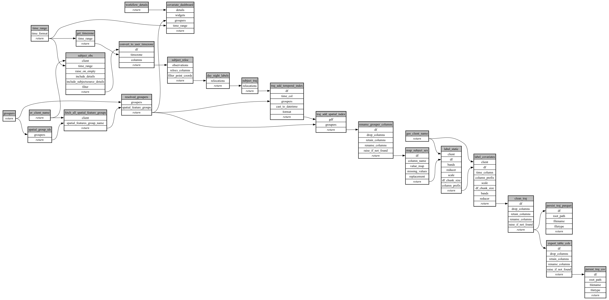

```
# AUTOGENERATED BY ECOSCOPE-WORKFLOWS; see fingerprint in README.md for details

```

```yaml
# fingerprint:
artifacts_sha256_basic: 191a417c3f4812883d943747ccae8863f35e7518a512530626989a02d575c47e
artifacts_sha256_strict: 0d37a9f76cbd74871faba1e80fb844ec372480be833edef5ac8f60d0c8ddae0d
installed_requirements:
- channel: https://repo.prefix.dev/ecoscope-workflows/
  name: ecoscope-platform
  version: {version: ==2.16.1}
- channel: conda-forge
  name: pydeck
  version: {version: ==0.9.2}
- channel: https://repo.prefix.dev/ecoscope-workflows-custom/
  name: covariate-labeling-tasks
  version: {version: ==0.2.0}
params_sha256: 0b5512fb0f08e2f36b49ae2bb4013a7826c5cb30eb3569769efefc288e36177a
spec_sha256: 6a75d24ac97e597164328edc75c4205bc4e02823125d9ef18395621a13c68fc7

```

# ecoscope-workflows-covariate-labeling-workflow


