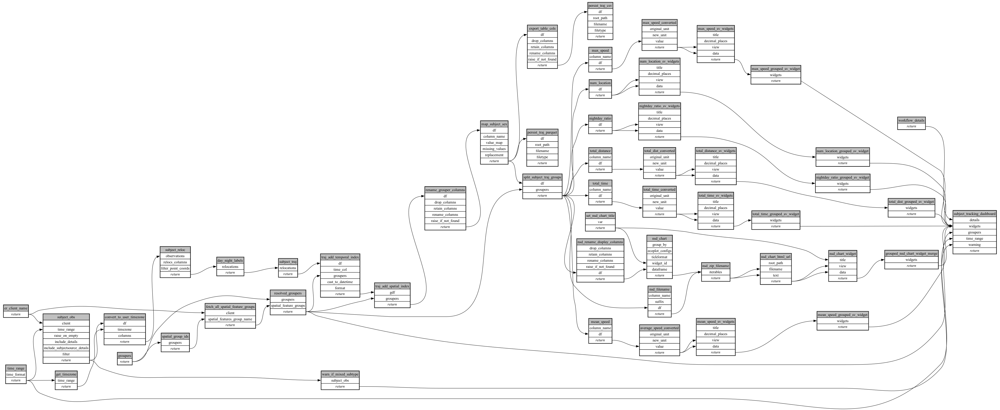

```
# AUTOGENERATED BY ECOSCOPE-WORKFLOWS; see fingerprint in README.md for details

```

```yaml
# fingerprint:
artifacts_sha256_basic: 6181469c73b4a9eddf4a7aa1e77856af12c7709c0f7b35c7fab671226b8d392d
artifacts_sha256_strict: 2581e6a4494757a725a4e2bbbd167d497e3d0f0e83c40e213220eb8a0f923a42
installed_requirements:
- channel: https://repo.prefix.dev/ecoscope-workflows/
  name: ecoscope-platform
  version: {version: ==2.16.1}
- channel: conda-forge
  name: pydeck
  version: {version: ==0.9.2}
params_sha256: e4c479b4986021537ee5ff4acb87cc358d4044fd1ea8f868cf8d3ee950d6f7f6
spec_sha256: ab3ab1d9aa1269775e597014cd4b69cb056ffa292cc586c9485c45267c71f639

```

# ecoscope-workflows-subject-trajectory-export-workflow


